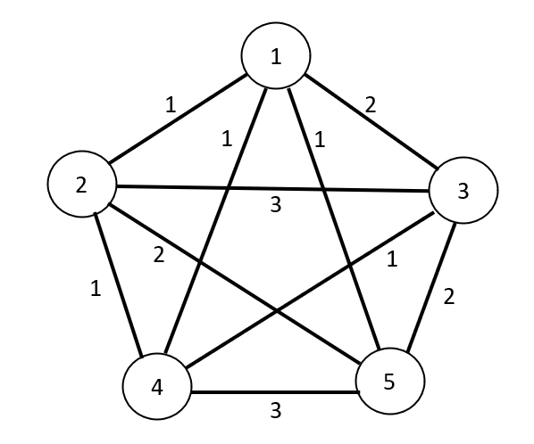
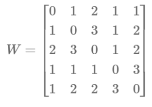

# A complete graph for a complete squad

At the 2022 FIFA World Cup in Qatar, each team has a squad of 26 players, but only 11 can be selected in the starting lineup. This means there are $\binom{26}{11} = 7726160$ different combinations for the manager to choose from! National team managers are usually very busy people and don't have the time to check each possibility, prompting them to seek the help of a mathematician. 

To assist us, the coach provides a crucial piece of information: a 'score' of how well each pair of footballers play together. For example, if two players go well in the same team, the score between them would be low. On the other hand, if the two make a horrid combination, like what could happen if they play in the same position, then their score would be very high. Typically, good players have low scores with all their teammates, while fringe players have high scores. 

We begin with a simpler scenario to better understand the problem. Consider a squad with only five players and suppose you need to select a team of three. Each player can be thought of as a vertex on a graph. The verticies are connected to each other by weighted edges, where the weighting corresponds to the score between players. Below is what such a graph could look like.



Since every vertex is connected to all others by a weighted edge, we have a *complete weighted graph*. If we choose three verticies and keep the edges that connect them, we get a weighted subgraph, and the *cost* is the sum of the weights. For example, if we select players 3, 4 and 5, then the cost of the team would be 1 + 2 + 3 = 6. 

More formally, we can represent the weight between players with the symmetric matrix



where the entry $W_{ij}$ is equal to the weight of the edge joining verticies $i$ and $j$. Then, for a team of players $x = (x_1,x_2,x_3)$, where each $x_i$ is a unique number in the set $\{1,2,3,4,5\}$, the cost is defined by

$ f(x) = \frac{1}{2}\sum_{i=1}^3 \sum_{j=1}^3 W_{x_i, x_j}.$

The task is to find three players $x$ which minimise the cost $f(x)$. As we do not have too many vertices, we can just list all possible combinations and find their cost. 

| Combination: $x$ | Cost: $f(x)$ |
| -----------: | ----: |
| (1,2,3)    | 6 |
| (1,2,4)    | 3 |
| (1,2,5)    | 4 |
| (1,3,4)    | 6 |
| (1,3,5)    | 4 |
| (1,4,5)    | 5 |
| (2,3,4)    | 5 |
| (2,3,5)    | 7 |
| (2,4,5)    | 6 |
| (3,4,5)    | 6 |

Using this exhaustive search we see that the three player combination with the lowest cost is (1,2,4). However, as the number of players increases, listing every combination becomes infeasible, and more sophisticated methods are required to find the best team.

# The Simulated Annealing optimisation algorithm

In mathematical terms, we are dealing with a non-convex optimisation problem with a discrete search space. Luckily, there exists a search method called *simulated annealing* which suits our problem particularly well. Essentially, we iterate in a special way over the search space in an attempt to find the global minimiser. Here's a breif outline of how it works

1. Begin with some guess of the solution
2. Randomly choose a 'neighbouring' solution and determine the change in cost $\Delta f$
3. If $\Delta f \leq 0$, we keep the new solution
4. If $\Delta f > 0$, we may or may not keep the solution, based on the probability of acceptance $P(accept \vert \Delta f)$.
    - The probability of acceptance decreases as $\Delta f$ increases, and
    - The probability of acceptance decreases as the 'temperature' $T$ decreases
5. Decrease the temperature and repeat the process for as long as you have time for or until the global minimum is reached. 


There are a number of things to unpack here. First of all, in this problem we will define two solutions as neighbouring if they differ by only one vertex. In the previous example, we would say (1,2,3) and (1,2,4) are neighbouring. This ensures our step sizes are not too large. 

The probability of acceptance is based on an acceptance function. Many different acceptance functions can be used for simmulated annealing, but one that satisfies the requirements is

$ P(accept \vert \Delta f) = \exp(\frac{-\Delta f}{T}).$

In practice, whether or not a step is accepted is determined by generating a random number $r$ between 0 and 1, and comparing it with $P(accept \vert \Delta f)$. If $P(accept \vert \Delta f) \geq r$, we accept the new $x$, otherwise, we keep the previous $x$. 

Finally, there is the idea of the temperature $T$. At the beginning of the search, the temperature is high, which makes $P(accept \vert \Delta f)$ high, meaning we are more likely to accept a new solution even if the cost increases. As the search continues, the temperature decreases, making it more likely to accept a solution only if it decreases the cost. The reason for the temperature is that it prevents us from converging to a local minimum. Just as with the acceptance function, there are many options for decreasing the temperature. For example, $T_k = T_0(1 - \frac{k}{k_{max}})$ where $T_k$ is the temperature at the $k$-th step, $T_0$ is the initial temperature, and $k_{max}$ is the maximum number of steps that will be taken in the search. In this case, the search ends when $T=0$, and the $x$ which we finish on is the estimate for the global minimiser. 

Here is how a simulated annealing search may look for our previous five player example, starting with the initial guess $x = (2,3,5)$. 

| $x$ | $\Delta f$ | $T$| Notes |
| ---: | -------: | ---:| ----- | 
| (2,3,5)    |  | 4 | We start with an initial guess, and then randomly choose a neighbour.|
| (1,3,5)    | -3 | 3 | The cost decreases so we accept the new solution. |
| (1,4,5)    | 1  | 2| The cost has increased, so we check the probability of acceptance. $P(accept \vert \Delta f) = \exp(\frac{-\Delta f}{T}) = \exp(-0.5) = 0.607$. Suppose we randomly generate $r=0.5$. Since $P(accept \vert \Delta f) \geq r$, we accept the new solution. |
| (1,3,5) | 1 | 1 | The cost again increases so we check the probability of acceptance. This time $P(accept \vert \Delta f) = \exp(\frac{-\Delta f}{T}) = \exp(-1) = 0.368$. Suppose we now randomly generate $r = 0.4$. Then $P(accept \vert \Delta f) < r$, so we stick with (1,4,5) and choose another neighbour.|
|(1,2,4) | - 2 | 0| The cost decreases so we keep the solution. As the temperature has reached zero we stop our search.|

At the end of the search, our estimate for the global minimiser is $x = (1,2,4)$. This is the same as the minimiser found with the exhaustive search but we needed to check three combinations less. One - nil to simulated annealing!


# Simulated Annealing for Arnold's Socceroos

Now that we understand how simulated annealing works, let's help out Australia's coach Graham Arnold pick the best starting lineup for the Socceroos. Unfortunately, Mr. Arnold was unable to provide a list of player pair scores, so we will have to make do with my estimate. 


**Note: These are complete guesses on my end and I by no means claim to be a football expert! If you wish to change the above weights, fell free to download the Excel file using the link.**

<a href="assets/SocceroosGraph.xlsx" download>Download the Excel file</a>

In the spreadsheet, all 26 players of the Australian squad are listed along with their jersey number and position. The table of values represents the matrix of weights $W$ which we defined earlier. The lower the score between players, the more green the cell is. We won't draw the graph that the matrix represents, but the idea is the same as with our five player example. 

A few things may stand out. Clearly, it would not be a good idea to have two goalkeepers in the starting lineup, so the score between them is very high at 100. In all other cases, the score between players is an integer between 1 and 10. 

The optimisation problem is to choose an $x$ (where the elements of $x$ are eleven unique integers between 1 and 26) that minimises the cost function

$ f(x) = \frac{1}{2}\sum_{i=1}^{11} \sum_{j=1}^{11} W_{x_i, x_j}.$

The simulated annealing algorithm can be implemented in Matlab. Follow along if you want. After downloading the Excel file, we read it in and define the cost function.

```matlab
Weight = readmatrix('SocceroosGraph.xlsx','Sheet','Sheet1','Range','D4:AC29');
Cost = @(x) 0.5*sum(Weight(x,x),'all');
```
Next we perform an exhuastive search (this takes about 10 seconds to run).

```matlab
%% Exhaustive search

% Create possible combinations of starting players
players = 1:26;
combos = nchoosek(players,11);

costCombo = nan(size(combos,1),1);
for k = 1:size(combos,1)
    costCombo(k) = Cost(combos(k,:));
end
[lowestCost, i] = min(costCombo);
% Lowest cost XI
bestEleven = combos(i,:)
```
After checking the more than 7 million options, we get the output for the minimiser $x$.
```matlab
bestEleven =

     1     3     4     7     8    10    11    13    15    16    22
```
Finally, we can compare with the simulated annealing search.
```matlab
%% Simulated Annealing Search

x = 1:11;
xBest = x;
T0 = 10;
kmax = 1000;
for k = 1:kmax
    % Set Temperature
    T = T0*(1-k/kmax);
    % Choose neighbour
    subs = setdiff(players,x);
    subOut = randi(length(x),1);
    subIn = randi(length(subs),1);
    xNew = x;
    xNew(subOut) = subs(subIn);
    % Find change in cost
    deltaf = sum(Weight(xNew(subOut),xNew)) - sum(Weight(x(subOut),x));
    % Check acceptance
    if min(1,exp(-deltaf/T)) >= rand
        x = xNew;
    end
    if Cost(x) < Cost(xBest)
        xBest = x;
    end
end
xBest
```
Running the code (which takes a fraction of a second) gives the ouput for the global minimiser estimate.
```matlab
xBest =

     1    11    15     3    22     7     8    16    13    10     4
```

Although the order is jumbled up, the simulated annealing search has given exactly the same eleven players as the exhaustive search. And it only needed to check 1000 of the possible combinations! 

It is important to note that since the simulated annealing search uses randomness in the iterations, it is not guaranteed to converge to the global minimiser. However, with enough iterations it will always give a good estimate of the minimiser of $f(x)$. As we increase the number of verticies in the graph, an exhaustive search eventually becomes too difficult to complete. Simulated annealing will always remain an efficient option for finding the minimiser. 

I will finish this blog by summarising the eleven players which (according to maths and my estimations) will give Australia the best chance of winning the World Cup. Good luck lads!

| Number | Position | Name |
| -----------: | ----: | --- |
| 1   | GK | M Ryan |
| 3   | DF | N Atkinson |
| 4   | DF | K Rowles |
| 7   | FW | M Leckie |
| 8   | DF | B Wright |
| 10  | MF | A Hrustic |
| 11  | FW | A Mabil |
| 13  | MF | A Mooy |
| 15  | FW | M Duke |
| 16  | DF | A Behich |
| 22  | MF | J Irvine |
